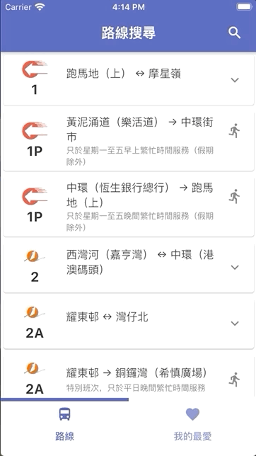
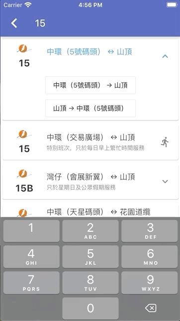

# wheels_draft

'Wheels' is an app designed to provide users with comprehensive route information across multiple bus operators in Hong Kong, more specifically Kowloon Motor Bus (KMB), Long Win Bus (LWB), CityBus (CTB) and New World First Bus (NWFB). 

## Getting Started
(Currently not available for release)

This section is written to teach users how to use the app. A traditional Chinese version of this section will also be written if I do manage to finish this project.

### Installation
(Placeholder for installation instructions on both iOS and Android Platforms)

### Using the app
As the app is opened, the user is greeted with a highly versatile home page. On this screen:
- The user can access a list of all the routes operated by the 4 operators; the route operator logo, number, origin, destination and special information (if necessary) is shown on each route card.
- Upon tapping a route card, the tapped card expands to show navigators to a specific bound of the route; in most cases there are 2 bounds (origin to destination and destination to origin),
- Tapping the search icon in the app bar reveals the on-screen keyboard, where the user can input a specific route,
- Swiping from the left edge reveals the home drawer, which includes navigators to settings (currently incomplete) and other useful links; and finally,
- Swiping from the right edge or tapping on the right icon within the bottom navigation bar reveals the yet-to-be-completed favourites page, which will include navigators to user specified routes or route-stops,

 

Clicking into a specific bound of a route reveals a new screen, where:
- The appbar title indicates the route number and direction,
- The tab bar at the bottom of the appbar provides navigators to ETA data (and route stop information), timetables and more,
- Expanding cards reveal additional relevant information.

 

## Documentation

The following is the documentation for the development of this app. At the moment, this section is also only written in English (ironically the app is currently only available in traditional Chinese). I will attempt to document this project comprehensively, though the format might be slightly (quite) informal since this is merely a casual personal project.

In addition, various technical details are omitted at the moment since they are subject to a huge refactoring when I start managing local storage.

### Motivation

Currently, there are mainly 2 companies that operate franchised bus routes in the Hong Kong Island, Kowloon and New Territories regions, namely:
- Kowloon Motor Bus  Co. (1933) Ltd, which operates KMB and LWB; and,
- NWS Holdings, which operates CTB and NWFB.

Both companies operate a wide range of routes, which can be classified into the following categories:
- Routes within the 3 regions mentioned above, 
- Jointly operated routes, most of which are cross-harbour routes,
- Routes connecting North Lantau and the 3 regions mentioned above; and,
- Other routes, such as border facility routes, racecourse routes and more.

Both companies provide their own apps for accessing information on routes that they operate. The key information that can be accessed in these apps are:
- Route stop information,
- Timetables,
- Mapped locations of routes and their stops,
- Special announcements; and perhaps most importantly,
- ETA (Expected Time of Arrival) information.

While these apps are extremely powerful on their own, they fall short in terms of providing the user with comprehensive information on all bus services in Hong Kong. This is a crucial flaw, in that there is a considerable amount of people that commute in between regions operated by different bus companies. For instance, up until very recently, ETA for jointly operated routes only contained data for the operator's own services, which were not available on the app of the other operator. The reason is both companies use different servers for distributing their data, and they distribute that data in inconsistent APIs, complicating it for open-source developers. Nevertheless, various applications, such as Google Maps, CityMapper and PokeGuide, have incorporated these APIs in their apps to various degrees of success.

### Aims

The app is intended to achieve the aims outlined above. That is, the information offered in the app includes:
- Route stop information,
- Timetables,
- Mapped locations of routes and their stops,
- Special announcements; and perhaps most importantly,
- ETA (Expected Time of Arrival) information.

In addition, to aid the approachability of data, various features are implemented, including a global search method and a favourites function.

I have decided to develop this app on Google's Flutter Platform, since it offers a relatively straightforward manner to implement both frontend and backend features easily. From a development standpoint, developing on Flutter is a refreshing experience, and I feel a greater sense of achievement because I actually get to see the interfaces that I have created. In contrary, I never really actually get to "see" what I have done when I was working on school C++ projects throughout the year, though the things we have achieved with C++ are way more advanced functionality-wise. 

Flutter allows me to spend most of my time developing the backend functionality of the app rather than the frontend interfaces. The high level widgets offered in Flutter are extremely useful for applications that mainly serve the purpose for fetching data, and the interfaces achieved are indeed consistent with typical Material-style apps. Most importantly of all, these widgets are compatible across both iOS and Android platforms, which means that it can potentially reach quite a bit of users (though I realise that this is probably quite far-fetched provided my current progress on the project).

One thing to note is that I have never intended to develop this application to replace highly-versatile transit apps such as Google Maps or CityMapper. These applications rely on highly vetted algorithms to provide information for directions, in which incorporating APIs for bus ETA is merely a small part; such functionality is highly advanced and indeed quite unachievable without the large databases that these companies have specifically created for these purposes. Instead, this is merely an attempt for me to develop an application that brings together the functionality of different bus operators' apps, in a hopefully clean and efficient manner.

### Stages of Development

The hot reload and restart capabilities of flutter allows me to simultaneously build code, test it, identify problems and make repetitive amendments. These are the most significant builds that have been completed up to Late June:

1. Interface for listing route stops, and data fetching for routes,
2. Tabbed interfaces for routes, for other information such as timetables, and special announcements,
3. Overall home interface for searching routes; and,
4. Interfaces for favourites and settings drawer.

At this point, I have pretty much achieved the functional requirements outlined in the aims. However, in order to get the favourites page and settings drawer running, the following changes have to be made:

5. Management of local storage, such that favourites can be kept locally, and route information is only reloaded when necessary; and,
6. Support for English (Currently, the only available language is traditional Chinese).

### APIs

The following is a non-exahustive list of sites, such as research papers or data dictionaries, that describe the functionality of the APIs:
- [Research on sniffing networks when using NWFB and KMB apps](https://i.cs.hku.hk/fyp/2018/fyp18019/wp-content/uploads/2019/04/final-report-revised.pdf)
- [NWFB API Data Dictionary](https://www.nwstbus.com.hk/datagovhk/bus_eta_spi_specifications.pdf)

#### Links to example APIs
- [KMB 53 Route Stops](http://search.kmb.hk/KMBWebSite/Function/FunctionRequest.ashx/?action=getstops&route=53&bound=1)
- [KMB 1 ETA at stop NA06N21500](http://etav3.kmb.hk/?action=geteta&lang=tc&route=1&bound=2&stop=NA06N21500&stop_seq=3&serviceType=01&updated=1540284711000)
- [KMB 286X Schedule](http://search.kmb.hk/KMBWebSite/Function/FunctionRequest.ashx/?action=getschedule&route=286X&bound=1)
- [KMB 286X Special Announcements](http://search.kmb.hk/KMBWebSite/Function/FunctionRequest.ashx/?action=getannounce&route=286X&bound=1)
- [KMB 286X Bus to bus interchange information](http://search.kmb.hk/KMBWebSite/Function/FunctionRequest.ashx/?action=getbbiforroute&route=286X&bound=1)
- [CTB 11 Route Stops](https://rt.data.gov.hk/v1/transport/citybus-nwfb/route-stop/ctb/1/inbound)
- [CTB 11 ETA at stop 001145](https://rt.data.gov.hk//v1/transport/citybus-nwfb/eta/CTB/001145/11)

### References

(Nope, this is not cited in a proper IEEE/Chicago/MLA/whatever standard, but I do want to acknowledge the things I have read to work on this project.)

- https://i.cs.hku.hk/fyp/2018/fyp18019/wp-content/uploads/2019/04/final-report-revised.pdf (Wong San Yu)
- https://www.nwstbus.com.hk/datagovhk/bus_eta_spi_specifications.pdf (NWS Holdings)
- https://github.com/mob41/KmbETA-API
- https://www.youtube.com/watch?v=jVVCHzkI8as ( Bram Vanbilsen)
- https://github.com/bramvbilsen/Flutter-JSON-Storage-Tutorial/blob/master/lib/main.dart (bramvbilsen  et al.)
- https://rickyanto.com/cache-locally-on-flutter-with-localstorage/ (Isak Rickyanto)
- https://medium.com/flutter-community/parsing-complex-json-in-flutter-747c46655f51 (Pooja Bhaumik)

